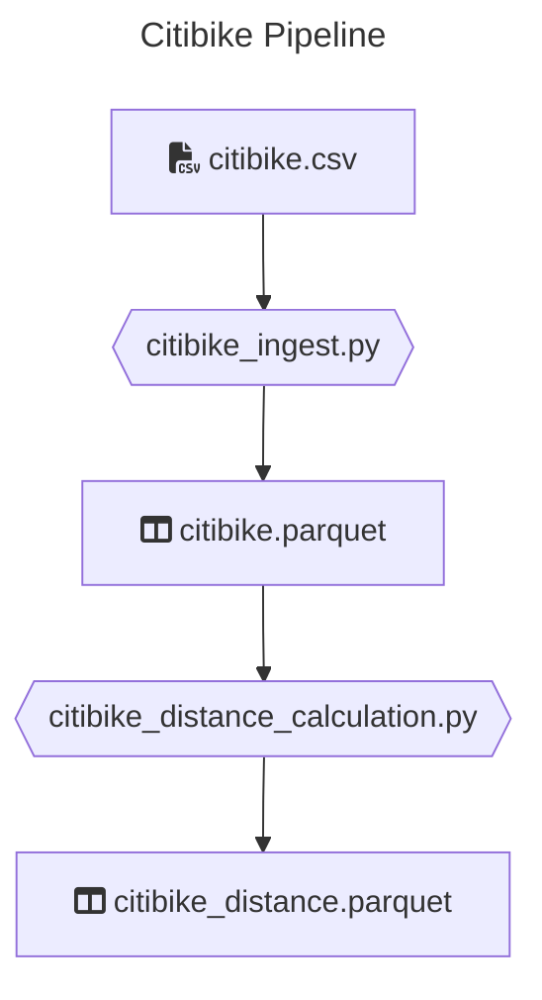
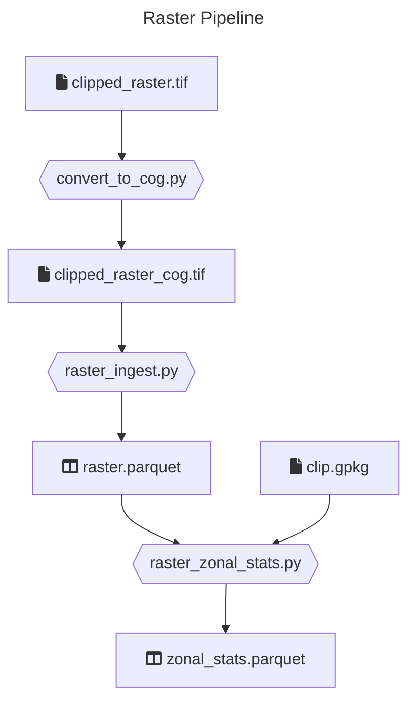

# Data transformations with Python

This is a collection of _Python_ jobs that extract, transform and load data using _PySpark_ and _Apache Sedona_ for geospatial processing. Jobs are designed to run on a _Spark_ cluster (via `spark-submit`).

## Setup

### Local Setup

> 💡 If you don't manage to run the local setup or you have restrictions to install software in your laptop, use the [gitpod](#gitpod-setup) one

#### Pre-requisites

Please make sure you have the following installed and can run them

- Python (3.11.X), you can use for example [pyenv](https://github.com/pyenv/pyenv#installation) to manage your python versions locally
- [Poetry](https://python-poetry.org/docs/#installation)
- Java (11), you can use [sdkman](https://sdkman.io/) to install and manage java locally

#### Windows users

We recommend using WSL 2 on Windows for this exercise, due to the [lack of support](https://cwiki.apache.org/confluence/display/HADOOP2/WindowsProblems) of windows paths from Hadoop/Spark.

Follow instructions on the [Windows official page](https://learn.microsoft.com/en-us/windows/wsl/setup/environment)

> 💡 In case of issues, like missing permissions on the machine, please use the [gitpod setup](#gitpod-setup)

#### Install all dependencies

```bash
poetry install
```

### Gitpod setup

Alternatively, you can setup the environment using

[](https://gitpod.io/#https://github.com/techops-recsys-lateral-hiring/dataengineer-transformations-python)

There's an initialize script setup that takes around 3 minutes to complete. Once you use paste this repository link in new Workspace, please wait until the packages are installed. After everything is setup, select Poetry's environment by clicking on thumbs up icon and navigate to Testing tab and hit refresh icon to discover tests.

Note that you can use gitpod's web interface or setup [ssh to Gitpod](https://www.gitpod.io/docs/references/ides-and-editors/vscode#connecting-to-vs-code-desktop) so that you can use VS Code from local to remote to Gitpod

Remember to stop the vm and restart it just before the interview.

### Verify setup

> All of the following commands should be running successfully

#### Run unit tests

```bash
poetry run pytest tests/unit
```

#### Run integration tests

```bash
poetry run pytest tests/integration
```

#### Run style checks

```bash
poetry run mypy --ignore-missing-imports --disallow-untyped-calls --disallow-untyped-defs --disallow-incomplete-defs \
            data_transformations tests

poetry run pylint data_transformations tests
```

### Anything else?

All commands are passing?  
You are good to go!

## Jobs

There are two pipelines in this repo: Citibike and Raster.

### Code walk

```

/
├─ /data_transformations    # Main Python library with transformation logic
│  ├─ /citibike             # Citibike ingest & distance calculation
│  └─ /raster               # Raster ingest & zonal statistics
│
├─ /jobs                    # Entry points for each job (argument parsing)
│
├─ /resources               # Raw datasets
│  ├─ /citibike             # citibike.csv, citibike_extension.csv
│  ├─ clipped_raster.tif    # GeoTIFF raster (clipped to Switzerland)
│  └─ clip.gpkg             # GeoPackage vector boundary used to clip the raster
│
├─ /tests
│  ├─ /unit                 # Unit tests (no Spark required)
│  ├─ /integration          # Integration tests
│  ├─ test_sedona.py        # Verifies Sedona vector functions (ST_Point)
│  └─ test_geotools.py      # Verifies Sedona raster + geotools-wrapper JARs
│
├─ Dockerfile               # Docker image definition (builds & verifies setup)
├─ .pylintrc
├─ poetry.lock
├─ pyproject.toml
└─ README.md

```

### Citibike

**_This problem uses data made publicly available by [Citibike](https://citibikenyc.com/), a New York based bike share company._**

For analytics purposes, the BI department of a hypothetical bike share company would like to present dashboards, displaying the
distance each bike was driven.



There is a dump of the datalake for this under `resources/citibike/citibike.csv` with historical data.

#### Ingest

Reads a `*.csv` file and transforms it to parquet format. The column names will be sanitized (whitespaces replaced).

##### Input

Historical bike ride `*.csv` file:

```csv
"tripduration","starttime","stoptime","start station id","start station name","start station latitude",...
364,"2017-07-01 00:00:00","2017-07-01 00:06:05",539,"Metropolitan Ave & Bedford Ave",40.71534825,...
...
```

##### Output

`*.parquet` files containing the same content

```csv
"tripduration","starttime","stoptime","start_station_id","start_station_name","start_station_latitude",...
364,"2017-07-01 00:00:00","2017-07-01 00:06:05",539,"Metropolitan Ave & Bedford Ave",40.71534825,...
...
```

##### Run the job

```bash
poetry build && poetry run spark-submit \
    --master local \
    --py-files dist/data_transformations-*.whl \
    jobs/citibike_ingest.py \
    <INPUT_FILE_PATH> \
    <OUTPUT_PATH>
```

#### Distance calculation

This job takes bike trip information and computes the "as the crow flies" distance traveled for each trip using **Apache Sedona**.

Distance is calculated using Sedona's `ST_Distance` with coordinate reprojection:
1. Start and end coordinates (WGS84 / EPSG:4326) are converted to geometry points via `ST_Point`
2. Points are reprojected to Web Mercator (EPSG:3857) via `ST_Transform`, giving distances in metres
3. `ST_Distance` computes the straight-line distance between the two projected points
4. Result is divided by 1609.344 to convert metres to miles

##### Input

Historical bike ride `*.parquet` files

```csv
"tripduration",...
364,...
...
```

##### Outputs

`*.parquet` files containing historical data with distance column containing the calculated distance.

```csv
"tripduration",...,"distance"
364,...,1.34
...
```

##### Run the job

```bash
poetry run python jobs/citibike_distance_calculation.py \
    resources-out/citibike_ingest \
    resources-out/citibike
```

---

## Raster

A geospatial pipeline that processes a GeoTIFF raster and computes per-zone statistics using a vector clip boundary.
The raster covers Switzerland and was pre-clipped using `clip.gpkg`.



### COG Conversion

Converts the source GeoTIFF to a **Cloud Optimized GeoTIFF (COG)**. COGs reorganize the internal file structure into tiled blocks with embedded overviews, enabling Spark workers to fetch only the tiles they need via HTTP range requests when the file is stored in cloud object storage (S3, GCS, ADLS).

> COG conversion uses `rasterio` (backed by GDAL) — Spark/Sedona can read COGs but cannot write them.

The conversion:
1. Opens the source GeoTIFF
2. Builds internal overviews at levels 2, 4, 8, 16 (using average resampling)
3. Writes a tiled (512×512), DEFLATE-compressed COG

```bash
poetry run python jobs/convert_to_cog.py \
    resources/clipped_raster.tif \
    resources/clipped_raster_cog.tif
```

### Ingest

Reads the GeoTIFF (or COG) and writes it as Parquet, extracting the following metadata:

| Column | Description |
|---|---|
| `raster` | The raster object (Sedona GridCoverage2D) |
| `width` | Number of pixels in the X direction |
| `height` | Number of pixels in the Y direction |
| `num_bands` | Number of raster bands |
| `metadata` | Full GDAL metadata array |
| `envelope` | Bounding geometry in WGS84 |

```bash
poetry run python jobs/raster_ingest.py \
    resources/clipped_raster_cog.tif \
    resources-out/raster_ingest
```

### Zonal Statistics

Reads the ingested raster Parquet and the `clip.gpkg` vector layer. For each zone polygon, computes the following statistics for **band 1** using Sedona's `RS_ZonalStats` (nodata pixels excluded):

| Column | Description |
|---|---|
| `zone_geometry` | The zone polygon geometry |
| `pixel_count` | Number of valid pixels within the zone |
| `pixel_sum` | Sum of pixel values |
| `pixel_mean` | Mean pixel value |
| `pixel_stddev` | Standard deviation of pixel values |
| `pixel_min` | Minimum pixel value |
| `pixel_max` | Maximum pixel value |

```bash
poetry run python jobs/raster_zonal_stats.py \
    resources-out/raster_ingest \
    resources/clip.gpkg \
    resources-out/raster_zonal_stats
```

### Run the full raster pipeline

```bash
poetry run python jobs/convert_to_cog.py \
    resources/clipped_raster.tif \
    resources/clipped_raster_cog.tif && \
poetry run python jobs/raster_ingest.py \
    resources/clipped_raster_cog.tif \
    resources-out/raster_ingest && \
poetry run python jobs/raster_zonal_stats.py \
    resources-out/raster_ingest \
    resources/clip.gpkg \
    resources-out/raster_zonal_stats
```

---

## Reading List

If you are unfamiliar with some of the tools used here, we recommend some resources to get started

- **pytest**: [official](https://docs.pytest.org/en/8.2.x/getting-started.html#get-started)
- **pyspark**: [official](https://spark.apache.org/docs/latest/api/python/index.html) and especially the [DataFrame quickstart](https://spark.apache.org/docs/latest/api/python/getting_started/quickstart_df.html)

### Run Docker Container

```bash
docker build -t de-python .
docker run -it --rm -v $(pwd):/app de-python bash
```

### Test Sedona and Geotools

Verify that Sedona vector functions and the geotools-wrapper JAR are working correctly:

```bash
# Verifies Sedona vector functions (ST_Point)
poetry run python tests/test_sedona.py

# Verifies Sedona raster functions + geotools-wrapper (RS_FromGeoTiff, RS_ZonalStats, etc.)
poetry run python tests/test_geotools.py
```

Both scripts are also run automatically during `docker build` to validate the image.