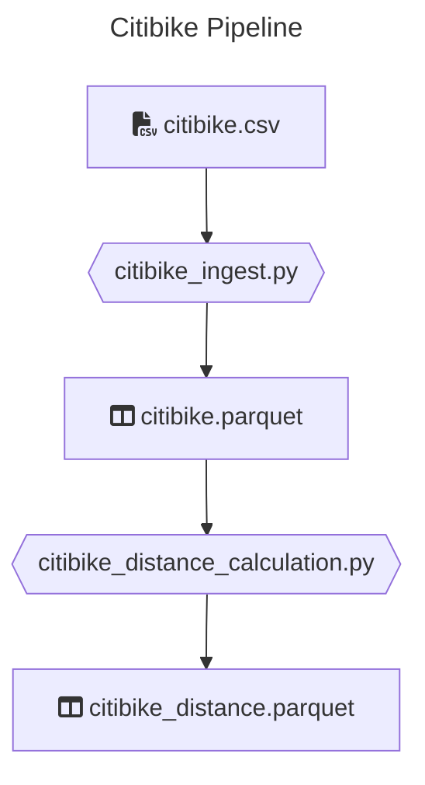
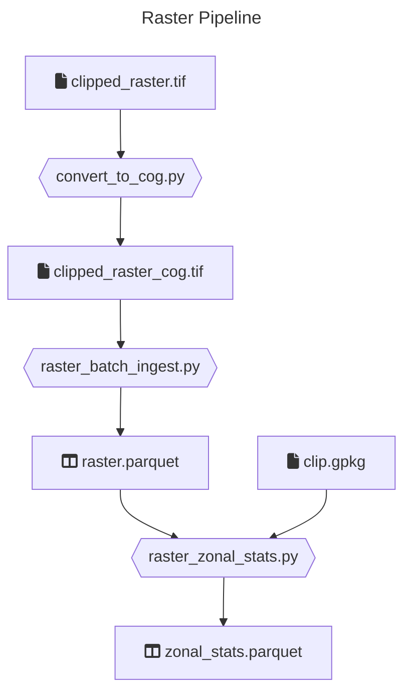
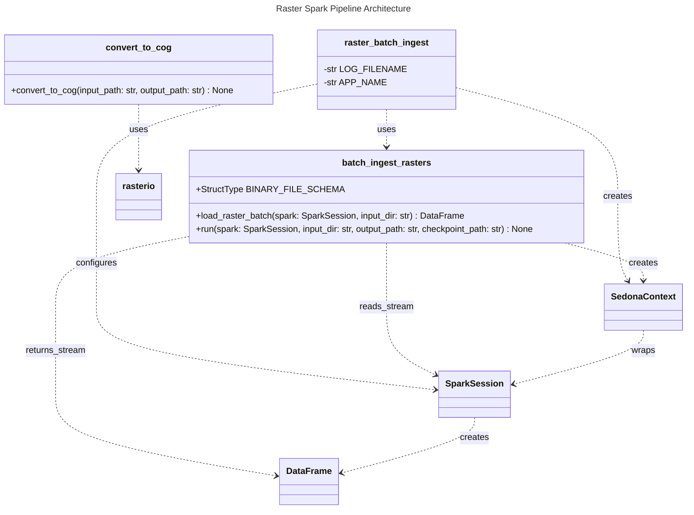

# Geospatial Data Lake with PySpark and Apache Sedona

This is a collection of _Python_ jobs that extract, transform and load data using _PySpark_ and _Apache Sedona_ for geospatial processing. Jobs are designed to run on a _Spark_ cluster (via `spark-submit`).

The pipelines follow a **data lake medallion architecture**: raw source files (CSV, GeoTIFF) are ingested into a Bronze layer as Parquet, then refined into a Silver layer with computed fields (distances, zonal statistics). Each layer is stored as files on disk, mirroring how data would flow through a cloud object store (S3, GCS, ADLS) in a production data lake.

Raster ingestion uses **Spark Structured Streaming** with `trigger(availableNow=True)` and the `binaryFile` source — an open-source alternative to Databricks Autoloader (which requires the proprietary `cloudFiles` format). It scans a directory for new `.tif` files, processes only those not yet ingested (tracked via checkpoint), and exits when done. This makes it safe to re-run incrementally as new raster files arrive.

## Setup

### Build and run the Docker container

```bash
docker build -t de-python .
docker run -it --rm -v $(pwd):/app de-python bash
```

### Verify setup

> Run these inside the container. All commands should complete successfully.

#### Run unit tests

```bash
poetry run pytest tests/unit
```

#### Run integration tests

```bash
poetry run pytest tests/integration
```

#### Run style checks

```bash
poetry run mypy --ignore-missing-imports --disallow-untyped-calls --disallow-untyped-defs --disallow-incomplete-defs \
            data_transformations tests

poetry run pylint data_transformations tests
```

### Test Sedona and Geotools

Verify that Sedona vector functions and the geotools-wrapper JAR are working correctly:

```bash
# Verifies Sedona vector functions (ST_Point)
poetry run python tests/test_sedona.py

# Verifies Sedona raster functions + geotools-wrapper (RS_FromGeoTiff, RS_ZonalStats, etc.)
poetry run python tests/test_geotools.py
```

Both scripts are also run automatically during `docker build` to validate the image.

### Anything else?

All commands are passing?  
You are good to go!

### Logs

All jobs write logs to `project.log` in the working directory. To follow logs while a job is running:

```bash
tail -f project.log
```

## Jobs

There are two pipelines in this repo: Citibike and Raster.

### Code walk

```

/
├─ /data_transformations    # Main Python library with transformation logic
│  ├─ /citibike             # Citibike ingest & distance calculation
│  └─ /raster               # Raster ingest & zonal statistics
│
├─ /jobs                    # Entry points for each job (argument parsing)
│
├─ /resources               # Raw datasets
│  ├─ /citibike             # citibike.csv, citibike_extension.csv
│  ├─ clipped_raster.tif    # GeoTIFF raster (clipped to Switzerland)
│  └─ clip.gpkg             # GeoPackage vector boundary used to clip the raster
│
├─ /tests
│  ├─ /unit                 # Unit tests (no Spark required)
│  ├─ /integration          # Integration tests
│  ├─ test_sedona.py        # Verifies Sedona vector functions (ST_Point)
│  └─ test_geotools.py      # Verifies Sedona raster + geotools-wrapper JARs
│
├─ Dockerfile               # Docker image definition (builds & verifies setup)
├─ .pylintrc
├─ poetry.lock
├─ pyproject.toml
└─ README.md

```

### Citibike

**_This problem uses data made publicly available by [Citibike](https://citibikenyc.com/), a New York based bike share company._**

For analytics purposes, the BI department of a hypothetical bike share company would like to present dashboards, displaying the
distance each bike was driven.



There is a dump of the datalake for this under `resources/citibike/citibike.csv` with historical data.

#### Ingest

Reads a `*.csv` file and transforms it to parquet format. The column names will be sanitized (whitespaces replaced).

##### Input

Historical bike ride `*.csv` file:

```csv
"tripduration","starttime","stoptime","start station id","start station name","start station latitude",...
364,"2017-07-01 00:00:00","2017-07-01 00:06:05",539,"Metropolitan Ave & Bedford Ave",40.71534825,...
...
```

##### Output

`*.parquet` files containing the same content

```csv
"tripduration","starttime","stoptime","start_station_id","start_station_name","start_station_latitude",...
364,"2017-07-01 00:00:00","2017-07-01 00:06:05",539,"Metropolitan Ave & Bedford Ave",40.71534825,...
...
```

##### Run the job

```bash
poetry build && poetry run spark-submit \
    --master local \
    --py-files dist/data_transformations-*.whl \
    jobs/citibike_ingest.py \
    <INPUT_FILE_PATH> \
    <OUTPUT_PATH>
```

#### Distance calculation

This job takes bike trip information and computes the "as the crow flies" distance traveled for each trip using **Apache Sedona**.

Distance is calculated using Sedona's `ST_DistanceSphere`:
1. Start and end coordinates are converted to geometry points via `ST_Point` (longitude, latitude)
2. `ST_DistanceSphere` computes the great-circle distance between the two points in metres
3. Result is divided by 1609.344 to convert metres to miles

##### Input

Historical bike ride `*.parquet` files

```csv
"tripduration",...
364,...
...
```

##### Outputs

`*.parquet` files containing historical data with distance column containing the calculated distance.

```csv
"tripduration",...,"distance"
364,...,1.34
...
```

##### Run the job

```bash
poetry run python jobs/citibike_distance_calculation.py \
    resources-out/citibike_ingest \
    resources-out/citibike
```

---

## Raster

A geospatial pipeline that processes a GeoTIFF raster and computes per-zone statistics using a vector clip boundary.
The raster covers Switzerland and was pre-clipped using `clip.gpkg`.





### COG Conversion

Converts the source GeoTIFF to a **Cloud Optimized GeoTIFF (COG)**. COGs reorganize the internal file structure into tiled blocks with embedded overviews, enabling Spark workers to fetch only the tiles they need via HTTP range requests when the file is stored in cloud object storage (S3, GCS, ADLS).

> COG conversion uses `rasterio` (backed by GDAL) — Spark/Sedona can read COGs but cannot write them. Rather than loading the entire raster into memory, data is read and written in block-sized windows to keep memory usage bounded regardless of raster size. Overviews are built on a temporary on-disk copy so the source file is never modified. Currently runs locally; for a distributed file system, the output path would need to use a GDAL VSI path (e.g. `/vsis3/bucket/...`) to write directly to cloud storage.

The conversion:
1. Opens the source GeoTIFF
2. Builds internal overviews at levels 2, 4, 8, 16 (using average resampling)
3. Writes a tiled (512×512), DEFLATE-compressed COG

```bash
poetry run python jobs/convert_to_cog.py \
    resources/clipped_raster.tif \
    resources-out/cog/clipped_raster_cog.tif
```

### Ingest

Reads a directory of GeoTIFF (or COG) files and writes them as Parquet, extracting the following metadata.

> This job uses **Spark Structured Streaming** with `trigger(availableNow=True)`: it processes all unprocessed `.tif` files in the input directory and exits when done. A checkpoint tracks which files have already been ingested — re-running the job will only pick up files added since the last run.

| Column | Description |
|---|---|
| `path` | Source file path |
| `raster` | The raster object (Sedona GridCoverage2D) |
| `width` | Number of pixels in the X direction |
| `height` | Number of pixels in the Y direction |
| `num_bands` | Number of raster bands |
| `metadata` | Full GDAL metadata array |
| `envelope` | Bounding geometry in WGS84 |

```bash
poetry build && poetry run spark-submit \
    --master local \
    --py-files dist/data_transformations-*.whl \
    jobs/raster_batch_ingest.py \
    resources-out/cog/ \
    resources-out/raster_batch \
    resources-out/raster_batch_checkpoint
```

#### Memory-efficient alternative: COG block ingestion

If you are processing large rasters and encounter memory pressure (Spark executor OOM, or the full raster binary exceeding the Parquet row size limit), `data_transformations/raster/process_raster_memory_improved.py` provides an alternative ingestion strategy.

Instead of loading the full raster as a Sedona `GridCoverage2D` object, it drops the binary `content` immediately and uses a `mapInPandas` function to open each file with `rasterio` and yield **one row per COG tile block**. GDAL only reads the blocks it needs from disk, keeping memory usage bounded regardless of raster size.

**How GDAL reads COG blocks efficiently on local and distributed file systems**

A COG stores a tile index at the start of the file. When `rasterio` opens a file and calls `src.block_windows(1)`, GDAL reads that index first, then issues a separate **HTTP range request** for each block it needs — fetching only the bytes for that tile rather than streaming the full file. On a local disk, the same principle applies via byte-offset seeks. This means:

- Each Spark executor reads only the tile blocks assigned to it
- Memory per task is bounded to one block (e.g. 512×512 × num_bands × dtype size)
- On cloud storage (S3, GCS, ADLS), files are accessed via GDAL's VSI layer (`/vsis3/`, `/vsigs/`, `/vsiaz/`) which translates block reads into `GET` requests with `Range` headers — no full file download occurs

> To use this with cloud storage, pass a VSI path as `input_dir`, e.g. `s3://my-bucket/rasters/`. GDAL must be configured with the appropriate credentials (environment variables or instance role).

> **Caveat:** because the `raster` column is never produced, downstream Sedona functions such as `RS_ZonalStats`, `RS_BandAsArray`, and `RS_Envelope` are not available. Per-block statistics (mean, min, max, NaN count) must be computed with numpy inside the UDF. This approach is suited to pixel-level analytics but **cannot feed into the Zonal Statistics job**.

| Column | Description |
|---|---|
| `path` | Source file path |
| `block_x` | Pixel column offset of the block |
| `block_y` | Pixel row offset of the block |
| `width` | Block width in pixels |
| `height` | Block height in pixels |
| `num_bands` | Number of raster bands |
| `mean_value` | Mean pixel value across all bands for this block |

### Zonal Statistics

Reads the ingested raster Parquet and the `clip.gpkg` vector layer. For each zone polygon, computes the following statistics for **band 1** using Sedona's `RS_ZonalStats` (nodata pixels excluded):

> `zone_geometry` is stored using the **GeoParquet** standard — ISO WKB binary with a `geo` metadata block in the Parquet footer declaring the geometry column and CRS. This means standard tools (`geopandas`, DuckDB, QGIS) can read the file directly without a Spark/Sedona session, while keeping the geometry compact.

| Column | Description |
|---|---|
| `zone_geometry` | The zone polygon geometry |
| `pixel_count` | Number of valid pixels within the zone |
| `pixel_sum` | Sum of pixel values |
| `pixel_mean` | Mean pixel value |
| `pixel_stddev` | Standard deviation of pixel values |
| `pixel_min` | Minimum pixel value |
| `pixel_max` | Maximum pixel value |


### Run the full raster pipeline

```bash
poetry run python jobs/convert_to_cog.py \
    resources/clipped_raster.tif \
    resources-out/cog/clipped_raster_cog.tif && \

poetry build && poetry run spark-submit \
    --master local \
    --py-files dist/data_transformations-*.whl \
    jobs/raster_batch_ingest.py \
    resources-out/cog/ \
    resources-out/raster_batch \
    resources-out/raster_batch_checkpoint && \

poetry run python jobs/raster_zonal_stats.py \
    resources-out/raster_batch \
    resources/clip.gpkg \
    resources-out/raster_zonal_stats
```

### Visualize raster from Parquet

> This is an optional utility, not a required pipeline step.

Reads the ingested raster Parquet and writes the raster back to a GeoTIFF file using Sedona's `RS_AsGeoTiff`. The output is a fully georeferenced TIF preserving the original CRS, geotransform, and all bands.

```bash
poetry run python jobs/visualize_raster_band.py \
    resources-out/raster_batch \
    resources-out/raster_restored.tif
```

### Visualize zonal statistics as GeoPackage

> This is an optional utility, not a required pipeline step.

Reads the zonal statistics GeoParquet and exports it as a GeoPackage for use in GIS tools such as QGIS. The output contains a `zonal_stats` layer with zone geometries and all computed statistics.

```bash
poetry run python jobs/visualize_zonal_stats.py \
    resources-out/raster_zonal_stats \
    resources-out/zonal_stats.gpkg
```

---

## Future Improvements

These are not needed at the current scale (one raster, one clip polygon) but would be the right additions if the pipeline were to grow.

### Spatial indexing at scale

| Scenario | Recommendation |
|---|---|
| Thousands of zone polygons in the GeoParquet output | Add an **H3** cell ID column (Uber's hexagonal grid) on the zone centroid, sort the Parquet by it. Enables cheap partition pruning on spatial range queries in DuckDB, pandas, and Spark without a database |
| Large-scale spatial joins (many rasters × many zones) | Use Sedona's built-in **KDB-tree** or **Quad-tree** spatial partitioning to co-locate geometries that overlap before the join, avoiding a full cross-join |
| COG files on cloud storage | Already handled — the COG internal tile index is effectively an R-tree that GDAL uses to resolve block reads via HTTP range requests |

---

## Reading List

If you are unfamiliar with some of the tools used here, we recommend some resources to get started

- **pytest**: [official](https://docs.pytest.org/en/8.2.x/getting-started.html#get-started)
- **pyspark**: [official](https://spark.apache.org/docs/latest/api/python/index.html) and especially the [DataFrame quickstart](https://spark.apache.org/docs/latest/api/python/getting_started/quickstart_df.html)
- **Apache Sedona**: [official docs](https://sedona.apache.org/latest/), [raster functions reference](https://sedona.apache.org/latest/api/sql/Raster-operators/), [vector functions reference](https://sedona.apache.org/latest/api/sql/Vector-functions/)
